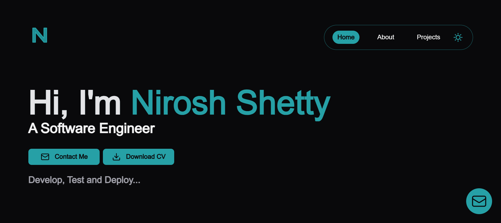

# Nirosh Shetty's Portfolio

Welcome to my personal developer portfolio!  
This project showcases my skills, experience, and selected projects as a software engineer, built with **Next.js**, **TypeScript**, **TailwindCSS**, and **Framer Motion**.

## 🚀 Features

- **Landing Page**: Animated hero section, typewriter effect, and contact modal.
- **Projects Showcase**: Interactive cards and detailed views for each project.
- **Skills Section**: Categorized skills with icons.
- **Experience & Education**: Timeline and details of my professional journey.
- **Responsive Design**: Mobile-friendly layouts using TailwindCSS.
- **SEO Optimized**: Meta tags, Open Graph, and sitemap generation.
- **Dark Mode**: Theme support for light and dark modes.
- **Contact Form**: Modal for direct communication.

## 🛠️ Tech Stack

- **Frontend**: Next.js, React, TypeScript, TailwindCSS, Framer Motion
- **Icons & Animations**: Custom SVGs, Framer Motion
- **SEO**: next-seo, sitemap generator
- **Deployment**: Vercel

## 📂 Project Structure

```
src/
  animation/         # Reusable animation components
  components/        # UI components (hero, projects, skills, etc.)
  data/              # Static data (projects, skills, experience)
  hooks/             # Custom React hooks
  layout/            # Layout components (navbar, footer)
  pages/             # Next.js pages
  scripts/           # Utility scripts (sitemap, etc.)
  styles/            # Global styles
  utility/           # Helper functions
public/              # Static assets (images, icons, resume)
```

## 📸 Screenshots

- **Landing Page**  
   
- **About Section**  
  
- **Projects Section**  
  

## 📝 Getting Started

1. **Clone the repository**

   ```bash
   git clone https://github.com/Nirosh-Shetty/my_portfolio.git
   cd my_portfolio
   ```

2. **Install dependencies**

   ```bash
   npm install
   ```

3. **Run the development server**

   ```bash
   npm run dev
   ```

4. **Open [http://localhost:3000](http://localhost:3000) in your browser**

## 🧩 Customization

- Update your details in `src/data/siteMetaData.mjs`
- Add/edit projects in `src/data/projects.ts`
- Add/edit skills in `src/data/skills.ts`
- Replace images in `public/images/`

---

<!-- **Made with ❤️ by Nirosh Shetty** -->

> **Credit:**  
> This portfolio project was originally created by [Amit Chauhan](https://github.com/BUMBAIYA).    
> I have **modified and customized** it to reflect my own style, projects, and personal details.


